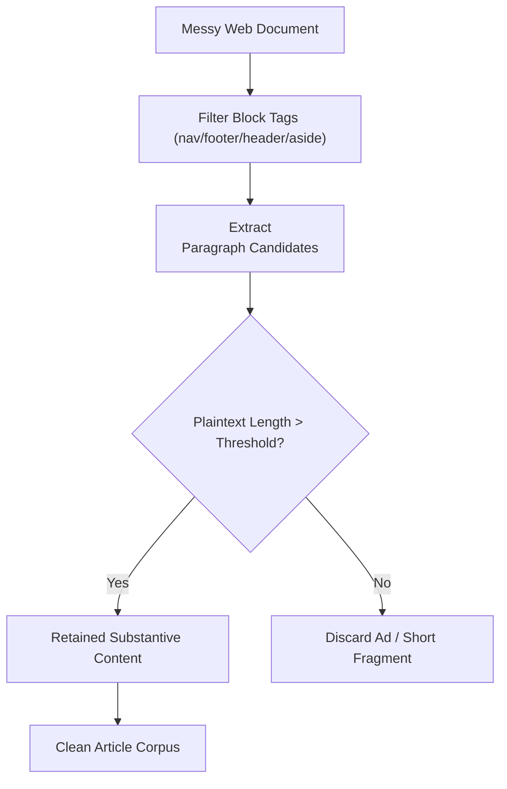

# genpark-dom-readability-boilerplate-remover-skill

Agent Skill implementing **DOM Readability & Boilerplate Navigation Stripping** in 100% Python standard library.

## Architectural Flow

```mermaid
flowchart TD
    HTML["Messy Web Document"] --> TagFilter["Filter Block Tags (nav/footer/header/aside)"]
    TagFilter --> PExtract["Extract <p> Paragraph Candidates"]
    PExtract --> DensityCheck{"Plaintext Length > Threshold?"}
    DensityCheck -->|Yes| Keep["Retained Substantive Content"]
    DensityCheck -->|No| Discard["Discard Ad / Short Fragment"]
    Keep --> Output["Clean Article Corpus"]
```
